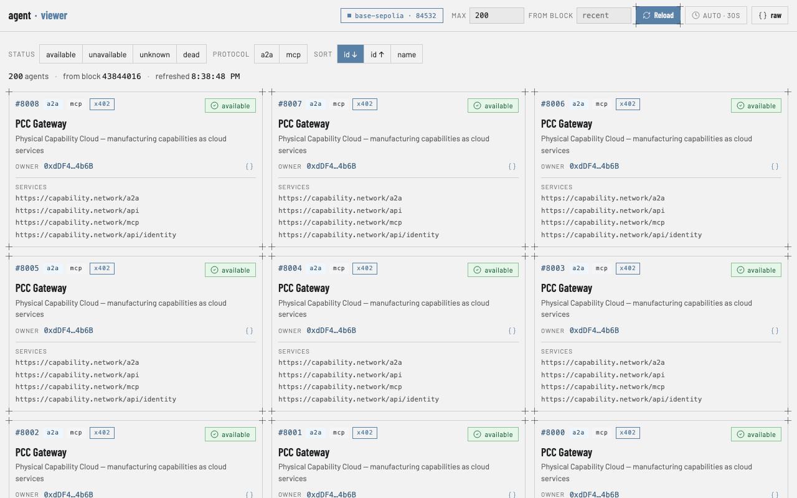
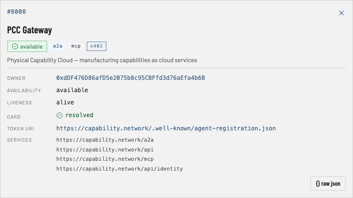

# agent-viewer

[English](README.md) | **한국어**

온체인 레지스트리의 **ERC-8004 에이전트**를 나열하고, **실제로 살아있는 에이전트**를 한눈에 보여주는 싱글 페이지 웹 앱입니다. **`agent-finder`** JSON API의 순수 프론트엔드로, 체인 관련 코드 없이 API를 호출해 렌더링만 담당합니다.



## 주요 기능

- **실시간 에이전트 그리드** — 스캔한 블록 범위에서 발견된 모든 에이전트를 반응형 카드 그리드로 표시하며, 온체인 liveness와 카드 상태에서 도출한 상태 배지(`available` / `unavailable` / `unknown` / `dead`)를 함께 보여줍니다.
- **카드 정보 보강** — 각 에이전트의 ERC-8004 등록 카드(`tokenURI`)를 브라우저에서 직접 가져와 설명, 썸네일, 카테고리/태그, `x402` 지원 여부, 가격이 포함된 스킬 정보를 표시합니다.
- **필터링 & 정렬** — 상태 및 프로토콜(`a2a` / `mcp`, 서비스 엔드포인트에서 도출)로 필터링하고, id 또는 이름으로 정렬합니다.
- **상세 다이얼로그** — 카드를 클릭하면 전체 정보를 확인할 수 있습니다: 소유자(Basescan 링크), availability, liveness, 카드 해석 결과, token URI, 서비스 엔드포인트, 스킬.

  
- **Raw JSON** — API 응답 전체 또는 개별 에이전트의 원본 데이터를 확인할 수 있습니다.
- **쿼리 컨트롤** — `max`와 `fromBlock`을 지정해 수동으로 다시 불러오거나 30초마다 자동 갱신할 수 있습니다.

## 빠른 시작

필요 환경: [Node.js](https://nodejs.org) ≥ 20, [pnpm](https://pnpm.io), 그리고 실행 중인 `agent-finder` API (기본 `http://localhost:4100`):

```bash
# agent-finder 레포에서
pnpm api        # → http://localhost:4100  (GET /api/agents?max=N&fromBlock=B)
```

그다음:

```bash
pnpm install
pnpm dev          # http://localhost:5173
```

프로덕션 빌드:

```bash
pnpm build        # 타입체크 + dist/로 번들
pnpm preview      # 프로덕션 빌드 서빙
```

## 설정

| 변수 | 기본값 | 설명 |
| --- | --- | --- |
| `VITE_API_BASE` | `http://localhost:4100` | agent-finder API의 베이스 URL |

빌드/개발 시점에 지정합니다. 예:

```bash
VITE_API_BASE=https://finder.example.com pnpm dev
```

## 스크립트

| 명령어 | 설명 |
| --- | --- |
| `pnpm dev` | Vite 개발 서버 실행 |
| `pnpm build` | 타입체크 후 프로덕션 빌드 |
| `pnpm preview` | 프로덕션 빌드 미리보기 |
| `pnpm test` | 테스트 실행 (Vitest + Testing Library) |
| `pnpm lint` | ESLint 린트 |
| `pnpm typecheck` | TypeScript 타입체크만 실행 |

## 동작 방식

앱은 하나의 엔드포인트(CORS 허용)만 호출합니다:

```
GET {API_BASE}/api/agents?max=<N>&fromBlock=<block>
```

응답으로 받은 에이전트를 렌더링합니다. 공유 응답 계약은 [`src/types.ts`](src/types.ts)에 정의되어 있습니다. 상태는 *liveness 우선, 그다음 availability* 순으로 도출됩니다(`dead`가 항상 우선). `tokenURI`가 가리키는 등록 카드는 브라우저에서 세션 단위 캐시와 함께 지연 로딩되며, 카드를 해석할 수 없는 에이전트도 실패 *이유*와 함께 목록에 표시됩니다.

## 기술 스택

React 18 · TypeScript (strict) · Vite · Vitest + Testing Library. UI 프레임워크 없이 순수 CSS 커스텀 프로퍼티 기반 디자인 시스템을 사용합니다([`src/index.css`](src/index.css) 참고).

## 라이선스

[MIT](LICENSE)
